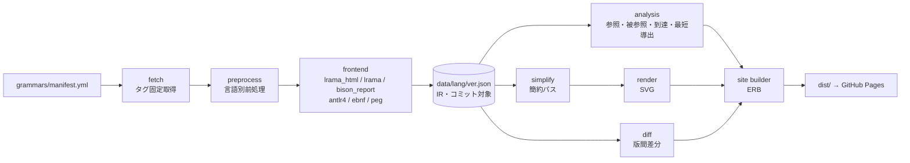

# Railroad Diagram Collection 設計書

実装記録: [IMPLEMENTATION.md](./IMPLEMENTATION.md)。以下の設計案に対する採用方式と検証方法を同文書に記載している。

- 対応文書: [ROADMAP.md](./ROADMAP.md) / [WORK_PROCEDURES.md](./WORK_PROCEDURES.md)
- 版: Draft v1（2026-09-30）
- 範囲: ROADMAP の Phase 1〜5 で構築する仕組み（Phase 0 は既存 HTML へのパッチのため WORK_PROCEDURES.md のみに記載）

---

## 1. 目的

現在のリポジトリは「Lrama が出力した HTML を手で置いたもの」であり、再生成・検証・拡張ができない。本設計は次の 3 点を実現する。

1. **再現性**: 文法ソース（リポジトリ・タグ・コミット）から 1 コマンドでサイト全体を生成できる。
2. **可読性**: パーサ生成器の生出力を、人が読むための図（簡約・表層トークン・相互参照）に変換する。
3. **拡張性**: バージョン追加・差分・言語追加・他形式の文法を、同じ中間表現（IR）の上で扱う。

---

## 2. 要件

### 2.1 機能要件

| 分類 | 要件 | 対応 ID |
|---|---|---|
| 取得 | manifest に定義した言語・バージョンの文法ソースをタグ固定で取得し、コミット SHA とハッシュを記録する | O-01 |
| 生成 | 文法 → IR → SVG → HTML を 1 コマンドで生成する | O-01, G-01 |
| 閲覧 | 目次・絞り込み・パーマリンク・被参照・到達パス・幅モード・テーマ | U-01〜U-10 |
| 表示 | 表層トークン表記、簡約図／原文どおり、BNF | G-02〜G-04 |
| 検索 | 言語内（規則・終端記号）と言語横断の検索 | U-01, U-15 |
| 版管理 | 複数バージョン、差分、変更履歴 | V-01〜V-04 |
| API | IR と索引を静的 JSON で公開する | G-08 |

### 2.2 非機能要件

| 項目 | 基準 |
|---|---|
| 性能 | 最大ページ（Ruby 最新版）で Lighthouse モバイル Performance ≥ 90。初期ロードの JS ≤ 30 KB（gzip） |
| プログレッシブエンハンスメント | JS 無効でも全図・目次・規則間リンクが機能する |
| アクセシビリティ | WCAG 2.2 AA。キーボードのみで全操作可能。axe 違反 0 |
| ブラウザ | Chrome / Edge / Firefox / Safari の最新 2 版、iOS Safari、Android Chrome |
| 再現性 | 同じ manifest と `Gemfile.lock` から同一の IR が生成される（生成日時を除く） |
| プライバシー | 外部オリジンへのリクエスト 0（Web フォント・CDN・解析タグを使わない） |
| 保守性 | フロント JS はランタイム依存ゼロ・ビルド不要。ビルドは Ruby のみ（CI の検査ツールは Node 可） |

---

## 3. アーキテクチャ



### 3.1 段階導入

| 段階 | frontend | 描画 | 備考 |
|---|---|---|---|
| Phase 1〜2 | `lrama_html`: Lrama の構文図 HTML を後処理し、規則名・SVG・参照先を取り出す（IR-lite） | Lrama が出力した SVG を加工して流用 | 早く UI 改善に着手するための暫定方式 |
| Phase 3〜 | `lrama`: Lrama をライブラリとして使う（または L-04 の JSON ダンプ）。フォールバックに `bison_report` | 自前レンダラ（railroad-diagrams 系の実装を vendoring して拡張） | 完全な IR。簡約・表層トークン・差分が可能になる |

UI 層（テンプレート・CSS・JS）と規則 ID（7 章）は両段階で共通とし、Phase 3 で差し替えてもリンクが切れないようにする。

### 3.2 技術選定

| 領域 | 採用 | 理由 | 代替案 |
|---|---|---|---|
| ビルド | Ruby 3.3+ / Rake / 自作 CLI `rdc` | Lrama と同じ言語でライブラリとして直接使える | Node |
| 文法解析 | Lrama（`Gemfile.lock` で固定） | 既存の 3 言語で実績あり | GNU Bison の `.output` |
| HTML 解析（Phase 1〜2） | Nokogiri（HTML5 パーサ） | インライン SVG を含む HTML を扱える | 正規表現（Phase 0 の暫定のみ） |
| 描画（Phase 3〜） | Lrama が利用している railroad-diagrams の Ruby 実装を vendoring し、href・class・`textLength` 付与を拡張 | 見た目の連続性 | JS 版を Node で実行 |
| テンプレート | ERB | 依存最小 | Astro / 11ty |
| フロント | 素の ES Modules | 軽量・長期保守 | Preact |
| テスト | minitest、Playwright、@axe-core/playwright、html-validate、lychee、Lighthouse CI | | RSpec |

Lrama の `--diagram` には `railroad_diagrams` gem が別途必要（Lrama の依存に含まれないため `Gemfile` に明記する）。

---

## 4. ディレクトリ構成

```
.
├── grammars/
│   ├── manifest.yml            # 言語・バージョン・取得元（人が編集）
│   ├── lock.yml                # 取得結果（コミット SHA・sha256）。rdc fetch が更新
│   └── <lang>/
│       ├── meta.yml            # 表示名・説明・トークン表記上書き・ε規則・カテゴリ・注記
│       └── examples.yml        # （Phase 5）規則ごとのコード例
├── data/                       # （Phase 3〜）生成した IR。差分レビューのためコミットする
│   └── <lang>/<version>.json
├── lib/rdc/
│   ├── cli.rb
│   ├── manifest.rb
│   ├── fetcher.rb
│   ├── slug.rb
│   ├── frontends/{lrama_html.rb, lrama.rb, bison_report.rb}
│   ├── ir/{model.rb, schema.rb, normalize.rb, simplify.rb, analysis.rb, diff.rb}
│   ├── render/{railroad/, svg.rb}
│   ├── site/{builder.rb, search_index.rb, sitemap.rb}
│   └── templates/{layout, index, language, terminals, diff, changelog, redirect}.html.erb
├── site/assets/{css/app.css, js/*.js, ogp.png, favicon.svg}
├── schema/ir-v1.json           # IR の JSON Schema
├── exe/rdc
├── test/                       # 単体・ゴールデン・等価性テスト（fixtures に小さな .y）
├── e2e/                        # Playwright
├── .github/workflows/{ci.yml, deploy.yml, upstream-watch.yml}
├── docs/{ROADMAP.md, DESIGN.md, WORK_PROCEDURES.md, adr/}
├── Gemfile, Gemfile.lock, Rakefile, package.json（検査ツール用）
└── LICENSE, README.md, CONTRIBUTING.md, CHANGELOG.md
```

`dist/` と `.cache/` は `.gitignore` に入れる。

---

## 5. データ設計

### 5.1 `grammars/manifest.yml`

```yaml
schema: 1
languages:
  ruby:
    name: Ruby
    frontend: lrama
    repo: https://github.com/ruby/ruby.git
    grammar: parse.y
    # Ruby 本体のビルド（common.mk）と同じ前処理: id2token.rb が defs/id.def を読む
    sparse: [/parse.y, /tool/id2token.rb, /defs/id.def]
    preprocess: "ruby tool/id2token.rb parse.y"     # 標準出力を Lrama の標準入力へ
    start: program                                    # 省略時は文法の開始記号
    tag_pattern: '^v(\d+)\.(\d+)\.0$'                 # Ruby 4.0 以降のタグは v4.0.0 形式
    notes: [parser_grammar, parse_y_vs_prism]
    versions:
      - { id: "4.0", ref: "v4.0.0", default: true }
  php:
    name: PHP
    frontend: lrama
    repo: https://github.com/php/php-src.git
    grammar: Zend/zend_language_parser.y
    sparse: [/Zend/zend_language_parser.y]
    tag_pattern: '^php-(\d+)\.(\d+)\.0$'
    notes: [parser_grammar]
    versions:
      - { id: "8.5", ref: "php-8.5.0", default: true }
      - { id: "8.4", ref: "php-8.4.0" }
  perl:
    name: Perl
    frontend: lrama
    repo: https://github.com/Perl/perl5.git
    grammar: perly.y
    sparse: [/perly.y]
    # Lrama 0.8.0 は「規則名とコロンの間のコメント」を読めないため除去する（L-05 が直るまで）
    preprocess: "ruby %{rdc_root}/grammars/perl/strip_rule_comments.rb perly.y"
    tag_pattern: '^v(5)\.(\d*[02468])\.0$'           # 偶数マイナーが安定版。キャプチャを連結して版 ID にする
    notes: [parser_grammar]
    versions:
      - { id: "5.44", ref: "v5.44.0", default: true }
      - { id: "5.42", ref: "v5.42.0" }
```

- `preprocess` はチェックアウト先をカレントディレクトリとして実行し、`%{rdc_root}` は本リポジトリのルートに置換する。
- 上記のタグ・前処理は 2026-09-30 に実際に取得・生成して動作を確認済み（Lrama 0.8.0 + railroad_diagrams gem）。

`grammars/lock.yml`（`rdc fetch` が自動更新、コミット対象）:

```yaml
php:
  "8.5": { commit: "685e99655ae97c667950f7f7d176985958718f56", sha256: "<grammar の sha256>", fetched_at: "2026-10-06T00:00:00Z" }
```

### 5.2 `grammars/<lang>/meta.yml`

```yaml
display_name: Ruby
description:
  en: "Ruby is a dynamic, object-oriented language ..."
  ja: "Ruby は動的なオブジェクト指向言語 ..."
epsilon_rules: [none]        # ε を導く補助規則。簡約時に「省略可能」として扱う
hide_rules: []               # 追加で内部扱いにする規則
token_display:               # 表層表記の上書き（文字列別名がない・不適切な場合）
  tIDENTIFIER: { display: "identifier", kind: class }
  tINTEGER:    { display: "integer",    kind: class }
  "'\\n'":     { display: "newline",    kind: class }
categories:                  # （Phase 5）
  statements:  [stmt, stmts, top_stmt]
  expressions: [expr, arg, primary]
simplify:                    # 簡約パスの言語別設定（省略時は既定値）
  factor_prefix: true
  inline_trivial: false
```

注記 `notes` の本文は `site/i18n/{en,ja}.yml` に置く。

| キー | 内容 |
|---|---|
| `parser_grammar` | この図はパーサ生成器向け文法から生成したもので、言語仕様そのものではない。字句解析器の状態や意味検査による制約は表れない |
| `parse_y_vs_prism` | Ruby 3.4 以降のデフォルトパーサは Prism。この図は `parse.y`（`--parser=parse.y`）に基づくため、受理範囲が一部異なる場合がある |

### 5.3 IR スキーマ（`data/<lang>/<version>.json`）

```json
{
  "schema": 1,
  "language": "php",
  "version": "8.5",
  "source": {
    "repo": "https://github.com/php/php-src.git",
    "ref": "php-8.5.0",
    "commit": "<sha>",
    "path": "Zend/zend_language_parser.y",
    "sha256": "<sha256>",
    "license": { "name": "<要確認>", "url": "<要確認>" }
  },
  "generator": { "frontend": "lrama", "tool_version": "<lrama --version>", "rdc": "0.5.0" },
  "start": "start",
  "terminals": [
    { "name": "T_ABSTRACT", "alias": "'abstract'", "display": "abstract", "kind": "keyword" },
    { "name": "';'", "display": ";", "kind": "punct" }
  ],
  "rules": [
    {
      "name": "example_list",
      "kind": "normal",
      "line": 123,
      "alternatives": [
        { "symbols": ["example_item"] },
        { "symbols": ["example_list", "','", "example_item"] }
      ]
    }
  ]
}
```

（`example_list` は説明用の架空の規則）

| フィールド | 説明 |
|---|---|
| `rules[].kind` | `normal` / `accept`（`$accept`）/ `midrule`（`$@N`・`@N`）/ `parameterized`（パラメータ化規則のインスタンス）/ `inline` |
| `rules[].origin` | `parameterized` のとき `{ "template": "option", "args": ["terms"] }` |
| `rules[].alternatives[].symbols` | 記号名の配列。空配列は ε。終端か非終端かは `terminals` と `rules` の名前で解決する |
| `terminals[].alias` | 文法ファイルの文字列別名（例: Ruby の `` "`class'" ``、PHP の `"'abstract'"`） |
| `terminals[].display` | 表示用文字列（別名から導出、`meta.yml` で上書き可） |
| `terminals[].kind` | `keyword` / `punct` / `class`（識別子・数値などの字句クラス）/ `internal`（`YYerror` 等） |

IR はコミット対象とする。上流の文法変更が PR 上で JSON の差分として読めるようにするため。スキーマは `schema/ir-v1.json` で検証し、破壊的変更時は `schema` を上げて API のパスも `/api/v2/` に分ける。

### 5.4 描画用の式木（簡約結果。ビルド時に生成しコミットしない）

```
Expr := { t: "seq",    items: [Expr] }
      | { t: "choice", items: [Expr] }
      | { t: "opt",    item: Expr }
      | { t: "star",   item: Expr, sep?: Expr }   # 0 回以上（sep は区切り）
      | { t: "plus",   item: Expr, sep?: Expr }   # 1 回以上
      | { t: "nt",     name }                      # 非終端記号 → リンク
      | { t: "term",   name }                      # 終端記号 → display で表示
      | { t: "eps" }
```

### 5.5 派生データ

| データ | 内容 | 用途 |
|---|---|---|
| `refs[rule]` | 規則が参照する非終端記号 | 参照一覧、到達パス |
| `used_by[rule]` | `refs` の逆引き | Used by 一覧 |
| `path[rule]` | 開始記号からの最短参照経路 | パンくず（U-08） |
| `terminal_uses[term]` | 終端記号を使う規則 | 終端記号索引（G-05） |
| `shortest[rule]` | 最短導出の終端記号列 | 導出例（G-06） |
| 検索索引 | `{n: 名前, s: slug, k: kind, a: 表示別名}` の配列 | 検索（U-01, U-15） |

---

## 6. ビルドパイプライン

### 6.1 fetch

```
git clone --depth 1 --branch <ref> --filter=blob:none --sparse <repo> .cache/src/<lang>/<ver>
git -C .cache/src/<lang>/<ver> sparse-checkout set --no-cone <sparse...>
```

- `git rev-parse HEAD` と文法ファイルの sha256 を `grammars/lock.yml` に記録する。
- キャッシュ済みでコミットが lock と一致すれば再取得しない。CI では `actions/cache` で `.cache/src` を保持する。
- GitHub 以外（例: git.ruby-lang.org）でも動くよう、API ではなく git で取得する。

### 6.2 preprocess

`preprocess` が定義されていればチェックアウト先で実行し、標準出力を `.cache/src/<lang>/<ver>/.rdc/grammar.y` に保存して以降の入力とする。未定義なら文法ファイルをそのまま使う。

### 6.3 frontend

| 名前 | 入力 | 出力 | 導入 |
|---|---|---|---|
| `lrama_html` | Lrama の構文図 HTML | IR-lite（規則名・SVG・参照先・終端記号） | Phase 1 |
| `lrama` | 文法ファイル（Lrama をライブラリとして使用） | IR | Phase 3 |
| `bison_report` | GNU Bison の `.output`（`bison -v`）の Grammar 節 | IR | Phase 3（Lrama で読めない文法用） |
| `antlr4` / `ebnf` / `peg` | 各形式の文法 | IR（または式木を直接） | Phase 5（C-02） |

- `lrama_html`: 生成 HTML を Nokogiri の HTML5 パーサで読み、`h2.diagram-header` とその直後の `svg.railroad-diagram` を組にする。参照先は `g.non-terminal text`、終端記号は `g.terminal text` から集める。B-06 の二重エスケープは、元文法と照合して挙動を確認したうえでここで補正する。
- `lrama`: Lrama の内部 API はバージョン依存のため、アダプタ層に閉じ込める。着手時に 2 日のスパイクで API を調査し、ADR-0001 に「Lrama ライブラリ直接／L-04 の JSON ダンプ追加／`.output` 解析」のどれを採るかを記録する。
- `bison_report`: Grammar 節の `N lhs: sym sym` と継続行 `| sym sym` を読む。空規則の表記（`ε`、`%empty`、`/* empty */`）はバージョンで異なるのですべて受け付ける。

### 6.4 analysis

- **開始記号**: `manifest` の `start`、なければ `$accept` 規則が参照する最初の非終端記号。
- **到達パス**: 開始記号から `refs` を BFS し、親ポインタから経路を復元する。
- **到達不能・非生産的な規則**: ビルドログに警告として出す（ページにはバッジ）。
- **最短導出（G-06）**: 各規則の最短の終端記号列長を不動点反復で求める。

```ruby
# rules: { "A" => [["x", "B"], []], ... }（空配列は ε）。rules にない記号は終端記号
def shortest_yields(rules)
  len  = Hash.new { |_, sym| rules.key?(sym) ? Float::INFINITY : 1 }
  best = {}
  loop do
    changed = false
    rules.each do |lhs, alts|
      alts.each do |alt|
        l = alt.sum(0) { |s| len[s] }
        next unless l < len[lhs]
        len[lhs] = l
        best[lhs] = alt
        changed = true
      end
    end
    break unless changed
  end
  expand = ->(sym) { rules.key?(sym) ? best.fetch(sym).flat_map(&expand) : [sym] }
  best.keys.to_h { |lhs| [lhs, expand.(lhs)] }
end
```

長さが真に減るときだけ更新するため、`best` の参照関係は循環せず展開は停止する。最短導出はあくまで文法上の例であり、字句解析や意味検査により実コードとして無効な場合がある旨をページに明記する。

### 6.5 simplify（G-03）

IR の各規則を式木（5.4）に変換し、次のパスを順に適用する。各パスは純粋関数 `Expr → Expr` とし、`meta.yml` の `simplify` で個別に無効化できる。

| 順 | パス | 変換 | 例 |
|---|---|---|---|
| 1 | `drop_midrule` | 中間アクション記号（`$@N`・`@N`、ε を導く）を選択肢から除去 | `k_class $@3 cpath` → `k_class cpath` |
| 2 | `epsilon` | 空の選択肢、または `epsilon_rules`（例: Ruby の `none`）だけの選択肢を「省略可能」にまとめる | `R: none \| a \| b` → `R = (a \| b)?` |
| 3 | `left_recursion` | `R: R β1 \| … \| R βn \| α1 \| … \| αm` → `(α1\|…\|αm) (β1\|…\|βn)*`。特に `R: α \| R s α` → `α (s α)*`（区切り付きループ） | `args: arg \| args ',' arg` → `arg` を `,` 区切りで 1 回以上 |
| 4 | `right_recursion` | `R: α \| α R` → `α+`、`R: α \| α s R` → 区切り付き `α+`、`R: ε \| α R` → `α*` | |
| 5 | `inline_parameterized` | `kind: parameterized` の規則を、パス 2〜4 で得た式木に置き換えて参照元へ展開（形状で判定するため、テンプレート名に依存しない） | `option_terms` → `terms?` |
| 6 | `factor_prefix` / `factor_suffix` | 選択肢の共通接頭辞・接尾辞をくくり出す（2 選択肢以上で共有する場合のみ） | `a b \| a c` → `a (b \| c)` |
| 7 | `inline_trivial`（既定 OFF） | 選択肢が 1 つで記号が 1 つの規則を参照元に展開 | |

自己再帰が上記の形に当てはまらない規則は変換しない（原文どおりの選択肢を描く）。

**等価性テスト**: 対象規則以外の記号を不透明な文字とみなし、長さ k 以下の記号列の集合を「元の BNF を展開して得たもの」と「簡約後の式木から列挙したもの」で比較する。

```ruby
require "set"

# 元の BNF: 規則 name の自己再帰を展開する
def bnf_strings(name, alts, k)
  out, seen, queue = Set.new, Set.new, [[name]]
  until queue.empty?
    form = queue.shift
    next if seen.include?(form) || form.count { _1 != name } > k || form.size > 2 * k + 2
    seen << form
    i = form.index(name)
    next out << form if i.nil?
    alts.each { |alt| queue << form[0...i] + alt + form[(i + 1)..] }
  end
  out
end

def concat(a, b, k) = Set.new(a.to_a.product(b.to_a).map { _1 + _2 }.select { _1.size <= k })

# 簡約後の式木
def expr_strings(e, k)
  case e[:t]
  when :nt, :term then Set[[e[:name]]]
  when :eps    then Set[[]]
  when :seq    then e[:items].reduce(Set[[]]) { |acc, x| concat(acc, expr_strings(x, k), k) }
  when :choice then e[:items].map { expr_strings(_1, k) }.reduce(Set.new, :|)
  when :opt    then expr_strings(e[:item], k) | Set[[]]
  when :star, :plus
    item = expr_strings(e[:item], k)
    sep  = e[:sep] ? expr_strings(e[:sep], k) : Set[[]]
    acc, frontier = item.dup, item
    loop do
      frontier = concat(concat(frontier, sep, k), item, k) - acc
      break if frontier.empty?
      acc |= frontier
    end
    e[:t] == :star ? acc | Set[[]] : acc
  end
end

# テスト: bnf_strings(r.name, alts, 6) == expr_strings(simplified, 6)
```

このハーネスは試作で動作確認済み（`list: item | list ',' item` と区切り付き `plus` が一致し、誤って `star` にした場合は不一致を検出する）。

### 6.6 render

生成する SVG の構造:

```html
<svg class="rr" role="group" aria-labelledby="h-r-stmt"
     width="640" height="122" viewBox="0 0 640 122">
  <!-- 非終端記号: 実リンク（JS 不要で遷移・戻る・新規タブ・キーボード操作が可能） -->
  <a href="#r-expr" class="rr-nt" aria-label="Go to rule expr">
    <g class="non-terminal"><rect .../><text ...>expr</text></g>
  </a>
  <!-- 終端記号: 表層表記を描き、内部名はツールチップ -->
  <g class="terminal" data-term="keyword_and">
    <title>keyword_and</title><rect .../><text ... textLength="24" lengthAdjust="spacingAndGlyphs">and</text>
  </g>
  <!-- 差分表示用に選択肢単位でクラスを付ける（Phase 4） -->
  <g class="alt alt-added">...</g>
</svg>
```

- 色はインライン指定せず CSS 変数で与える（ダークモード対応）。
- `textLength` を付けて、実フォントの字幅が想定と違っても箱からはみ出さないようにする（B-17）。
- 長さ 0 のパス（`h0`）を出力しない。座標は 0.5 単位に丸める。
- `<a>` は HTML として出力し、ブラウザが SVG 名前空間の `a` として解釈する（Chromium で動作確認済み）。

### 6.7 site builder

- ページ: トップ、言語×バージョン（「読みやすい表示」と「原文どおり」の 2 種）、終端記号索引、差分、変更履歴、ライセンス一覧、404、旧 URL のリダイレクト。
- アセットはファイル名にハッシュを付ける（`app.3f9c1a.css`）。
- `sitemap.xml`、`robots.txt`、`/api/v1/*` を出力する。
- ビルドの最後に整合性検査を行う: すべての `href="#…"` が同一ページ内の `id` を指し、`id` が重複していないこと。違反があればビルド失敗。

### 6.8 CLI

| コマンド | 説明 |
|---|---|
| `rdc fetch [lang[@ver]]` | 文法ソースを取得し `lock.yml` を更新 |
| `rdc ir [lang[@ver]]` | IR を生成して `data/` に書く（Phase 3〜） |
| `rdc build [--out dist] [--only lang]` | サイトを生成 |
| `rdc serve [--port 8000]` | `dist/` をローカル配信 |
| `rdc diff <lang> <from> <to> [--format md\|json]` | 版間差分を出力 |
| `rdc check-updates [--write-manifest]` | 上流の新タグを検出 |
| `rdc new-lang <id>` | manifest と meta.yml の雛形を作成 |
| `rdc doctor` | Git・Ruby・Lrama のバージョンなど環境を確認 |

---

## 7. URL 設計と ID 規約

### 7.1 URL

| パス | 内容 |
|---|---|
| `/` | トップ |
| `/<lang>/` | 既定バージョンの言語ページ（`canonical` は版付き URL） |
| `/<lang>/<ver>/` | 言語ページ（読みやすい表示） |
| `/<lang>/<ver>/raw/` | 言語ページ（原文どおり: 簡約なし・内部トークン名） |
| `/<lang>/<ver>/terminals/` | 終端記号索引 |
| `/<lang>/diff/<from>...<to>/` | 差分 |
| `/<lang>/changelog/` | 変更履歴 |
| `/licenses/` | 各文法ソースの出典とライセンス |
| `/api/v1/index.json` | 言語・バージョン一覧 |
| `/api/v1/<lang>/<ver>.json` | IR |
| `/api/v1/search/<lang>-<ver>.json` | 検索索引 |
| `/ruby.html` `/php.html` `/perl.html` | 旧 URL。`/<lang>/` へリダイレクト（ハッシュを維持） |

### 7.2 規則 ID（slug）

規則名の `[A-Za-z0-9_]` はそのまま残し、それ以外は UTF-8 の各バイトを `~XX`（大文字 16 進）に置き換えて `r-` を前置する。可逆で衝突がなく、URL フラグメントと HTML の `id` にそのまま使える。終端記号は `t-` を前置する。

| 名前 | ID |
|---|---|
| `stmt` | `r-stmt` |
| `$accept` | `r-~24accept` |
| `$@1` | `r-~24~401` |
| `option_'\n'` | `r-option_~27~5Cn~27` |
| `keyword_class`（終端記号） | `t-keyword_class` |

```ruby
module Rdc
  module Slug
    module_function

    def rule(name) = "r-" + encode(name)
    def terminal(name) = "t-" + encode(name)
    def encode(name) = name.b.gsub(/[^A-Za-z0-9_]/) { |c| format("~%02X", c.ord) }
  end
end
```

同じ規則名は全バージョンで同じ ID になるため、バージョン切替時にアンカーを維持できる。Phase 0 のパッチも同じ規約を使うので、その時点で共有されたリンクは以後も有効。

---

## 8. 画面設計

### 8.1 言語ページ（デスクトップ）

```
┌──────────────────────────────────────────────────────────────────┐
│ ◆ Railroad Diagrams │ Ruby ▾ │ 4.0 ▾ │ [ / 規則を検索…      ] │ ◐ │ GitHub │
├────────────────┬─────────────────────────────────────────────────┤
│ 目次            │ Ruby 4.0                                          │
│ [絞り込み…   ]  │ parse.y @ v4.0.0 (abc1234) · Lrama 0.8.0          │
│ ☐ 内部規則を表示│ ⓘ パーサ文法です。既定パーサ Prism とは差があり得ます│
│ ▸ 文            │ 表示: [読みやすい | 原文どおり]  幅: [原寸 | 合わせる]│
│   stmt          │─────────────────────────────────────────────────│
│   stmts         │ ## stmt                        🔗  ⤓  { }  ⛶    │
│ ▸ 式            │ program › top_stmts › top_stmt › stmt            │
│   expr          │ ┌──────────── 横スクロール ───────────────┐    │
│   …             │ │ ━━[expr]━━(and)━━[expr]━━               │    │
│                 │ └────────────────────────────────────────┘    │
│                 │ ▸ BNF   ▸ Used by (12)   ▸ 参照 (5)             │
└────────────────┴─────────────────────────────────────────────────┘
```

- モバイル（< 768px）: 目次はヘッダーのボタンで開くドロワー、ツールバーはメニューにまとめる。
- 図は既定で原寸＋横スクロール。「合わせる」モードでは `width: 100%; height: auto` で縦横比を保って縮小する。

### 8.2 規則セクションのマークアップ

```html
<section class="rule" id="r-stmt" data-kind="normal"
         style="contain-intrinsic-size: auto 220px">
  <header class="rule-head">
    <h2 class="rule-title" id="h-r-stmt"><a href="#r-stmt">stmt</a></h2>
    <div class="rule-tools"><!-- リンクコピー / 保存 / BNF / 全画面 --></div>
  </header>
  <nav class="rule-path" aria-label="Path from start symbol">…</nav>
  <figure class="rule-figure">
    <div class="diagram-scroll" tabindex="0" role="region" aria-label="Diagram of stmt">
      <svg class="rr" …>…</svg>
    </div>
  </figure>
  <details class="rule-bnf"><summary>BNF</summary><pre><code>…</code></pre></details>
  <details class="rule-usedby"><summary>Used by (12)</summary><ul>…</ul></details>
</section>
```

- `contain-intrinsic-size` はビルド時に SVG の高さから算出し、`content-visibility: auto` と組み合わせて画面外の描画を省く。
- スクロール可能領域にはキーボードで到達できるよう `tabindex="0"` を付ける（axe の `scrollable-region-focusable` 対策）。

### 8.3 トップページ

- 見出し・横断検索ボックス・言語カード（名前、収録バージョン、規則数、終端記号数、更新日、出典）を manifest と IR から自動生成する。
- 「構文図の読み方」は実際の小さな図（必須・省略可能・繰り返し・選択）で示す。

### 8.4 差分ページ

- 概要（追加・削除・変更された規則と終端記号の件数）、フィルタ（追加／削除／変更）。
- 変更された規則は旧版と新版の図を並べ（モバイルでは縦積み）、追加された選択肢を緑、削除された選択肢を赤で示す。色だけに頼らず `+`/`−` の記号とラベルも付ける。
- BNF の unified diff も表示する。

### 8.5 テーマ（CSS 変数）

```css
:root {
  color-scheme: light dark;
  --bg: #ffffff; --fg: #1f2328; --muted: #59636e; --border: #d1d9e0;
  --accent: #4b6584; --focus: #0969da;
  --rr-line: #333333;
  --rr-terminal: hsl(190 100% 83%);      /* 現行の配色を継承 */
  --rr-nonterminal: hsl(223 100% 83%);
  --rr-highlight: #eded91;
  --rr-added: #c9f5d0; --rr-removed: #ffd6d6;
}
@media (prefers-color-scheme: dark) {
  :root:not([data-theme="light"]) { /* ダーク値 */ }
}
:root[data-theme="dark"] { /* 同じダーク値 */ }
```

文字と背景のコントラストは AA（4.5:1 以上）を満たす値を CI の axe で確認する。

---

## 9. フロントエンド設計

### 9.1 モジュール

| ファイル | 役割 | 読み込み |
|---|---|---|
| `theme-init`（インライン数行） | 保存済みテーマを描画前に適用（ちらつき防止） | `<head>` 内 |
| `app.js` | 起動・各機能の初期化 | `type="module"` |
| `highlight.js` | 関連要素のハイライト（イベント委譲＋遅延構築の索引） | 起動時 |
| `toc.js` | 目次の絞り込み、現在位置の表示（IntersectionObserver） | 起動時 |
| `view-options.js` | 幅モード・内部規則の表示切替 | 起動時 |
| `search.js` | 検索（索引 JSON を遅延取得） | 検索欄に初めてフォーカスしたとき dynamic import |
| `popover.js` | 参照先の図のプレビュー（U-07） | `requestIdleCallback` |
| `shortcuts.js` | ショートカットと `?` ヘルプ（`<dialog>`） | 起動時 |
| `export.js` | SVG/PNG 保存 | クリック時に dynamic import |

### 9.2 関連要素ハイライト（B-09 の解消）

```js
// site/assets/js/highlight.js
const TARGET = "a.rr-nt, .rule-title";
let index = null; // slug -> Element[]

function buildIndex(root) {
  index = new Map();
  for (const a of root.querySelectorAll("a.rr-nt")) {
    const slug = a.getAttribute("href").slice(1);
    if (!index.has(slug)) index.set(slug, []);
    index.get(slug).push(a);
  }
}

const slugOf = (el) =>
  el.matches("a.rr-nt") ? el.getAttribute("href").slice(1) : el.closest("section.rule").id;

export function initHighlight(root = document.querySelector("main")) {
  let active = [];
  const clear = () => {
    for (const el of active) el.classList.remove("is-related");
    active = [];
  };
  const onEnter = (e) => {
    const t = e.target.closest?.(TARGET);
    if (!t) return;
    if (!index) buildIndex(root);
    clear();
    const slug = slugOf(t);
    const title = document.getElementById(slug)?.querySelector(".rule-title");
    active = [...(index.get(slug) ?? []), ...(title ? [title] : [])];
    for (const el of active) el.classList.add("is-related");
  };
  const onLeave = (e) => {
    const from = e.target.closest?.(TARGET);
    if (from && from !== e.relatedTarget?.closest?.(TARGET)) clear();
  };
  root.addEventListener("pointerover", onEnter);
  root.addEventListener("pointerout", onLeave);
  root.addEventListener("focusin", onEnter);
  root.addEventListener("focusout", onLeave);
}
```

リスナーは `main` に 4 つだけ。索引は最初のホバー時に 1 回だけ作る。マウスとキーボードの両方で動作する（Chromium で動作確認済み）。

### 9.3 表示モード

- 「読みやすい表示」と「原文どおり」は別ページとして生成し、切替はハッシュを維持したリンクにする。表示文字列が変わると箱の幅も変わるため、1 つの SVG を JS で書き換える方式は採らない。
- 幅モード（原寸／合わせる）と内部規則の表示は `<html>` の `data-*` 属性と CSS で切り替える。内部規則が非表示のときにその規則へのリンクを踏んだ場合は、自動的に表示状態にする。
- 設定は `localStorage`（キー `rdc:theme` / `rdc:width` / `rdc:internal`）に保存し、読み書きは `try/catch` で囲む。

### 9.4 検索

- 正規化: 小文字化し、`_`・`-`・空白を除く。規則名に加えて終端記号の表示名も対象にする（`class` で `keyword_class` を含む規則を探せる）。
- 採点: 完全一致 100、前方一致 80、部分一致 60、部分列一致 40（飛びの数で減点）。上位 20 件。
- UI は ARIA の combobox パターン（`role="combobox"` + `listbox`、上下キーで選択、Enter で遷移）。

---

## 10. アクセシビリティ設計

| 項目 | 設計 |
|---|---|
| 構造 | `header` / `nav`（目次）/ `main` / `footer` のランドマーク、本文へのスキップリンク。`h1` = 言語と版、`h2` = 規則 |
| 図 | SVG は `role="group"` と `aria-labelledby` で見出しに関連付ける。非終端記号は `<a>` でフォーカス可能、`aria-label` 付き。終端記号は `<title>` で内部名を示す |
| テキスト代替 | Phase 2 は「参照している規則・終端記号の一覧」、Phase 3 以降は BNF を `<details>` で提供する |
| フォーカス | `a.rr-nt:focus-visible rect` に太い枠線。見出しへの移動時は `scroll-margin-top` で固定ヘッダーに隠れないようにする |
| 動き | `prefers-reduced-motion: reduce` のときはスムーズスクロールを使わない |
| ショートカット | 入力欄にフォーカスがあるときは無効。1 文字ショートカットは設定で無効化できる（WCAG 2.1.4） |
| 色 | コントラスト AA。差分は色と記号の両方で示す |

---

## 11. 差分設計（V-02）

1. **正規化**: 選択肢を記号列のキー文字列にする。中間アクション記号（`$@N`・`@N`）は版ごとに番号がずれる（実例: PHP の `@12` → `@11`）ため除去し、`epsilon_rules` は ε に置き換える。記号名は HTML エスケープを解除した生の名前で比較する（Lrama の版で `>` の出力表記が異なる）。
2. **規則の対応付け**: 名前で対応付ける。新版のみ → 追加、旧版のみ → 削除、両方にありキー集合が異なる → 変更。
3. **選択肢の差分**: キー集合の差で追加・削除された選択肢を求める。並び順の変化だけの場合は「並び替えのみ」と注記する。
4. **終端記号の差分**: 追加・削除された終端記号（例: PHP 8.5 の `T_PIPE`）を一覧にする。
5. **名前変更の推定（R-06）**: 削除×追加の組で選択肢集合の Jaccard 係数が 0.8 以上なら「名前変更の候補」として示す。
6. **出力**: `diff.json`、Markdown 要約（上流監視ボットの PR 本文）、HTML ページ。
7. **描画**: 「原文どおり」の図を描く際に、選択肢ごとの `<g>` に `alt-added` / `alt-removed` クラスを付ける（レンダラ拡張）。

---

## 12. 品質保証

| 層 | 対象 | ツール | 合格基準 |
|---|---|---|---|
| 単体 | slug、manifest 検証、frontend 抽出、各簡約パス、analysis、diff | minitest | 全件合格 |
| 等価性 | 簡約前後の記号列集合（6.5） | minitest | 全規則で一致（k = 6 目安） |
| ゴールデン | 小さな `.y` の fixtures → IR JSON・SVG のスナップショット | minitest | 差分は PR で明示的に承認 |
| 整合性 | 内部リンクの参照先 `id` の存在、`id` の重複 | ビルド時の検査 | 違反 0 |
| HTML | `dist/` の全ページ | html-validate | エラー 0 |
| リンク | 内部リンク（PR 時）、外部リンク（週次） | lychee | 切れ 0 |
| E2E | 規則リンクで移動して「戻る」で復帰、目次の絞り込み、検索、テーマ、版切替でハッシュ維持 | Playwright | 全件合格 |
| a11y | 代表ページ（各言語の最新版、差分ページ、トップ） | @axe-core/playwright | 違反 0 |
| 視覚回帰 | 代表規則（ライト／ダーク × デスクトップ／モバイル） | Playwright スクリーンショット | 閾値内 |
| 性能 | 最大ページ | Lighthouse CI | 2.2 の予算内 |

---

## 13. CI/CD

| ワークフロー | トリガー | 内容 |
|---|---|---|
| `ci.yml` | `pull_request`、`push`（main） | テスト → ビルド → HTML 検証・リンク・E2E＋axe・Lighthouse を並列 |
| `deploy.yml` | `push`（main）、手動 | ビルド → `upload-pages-artifact` → `deploy-pages` |
| `upstream-watch.yml` | 週次スケジュール、手動 | 新タグ検出 → IR 生成 → 差分要約付き PR |

- Pages の Source を「GitHub Actions」に切り替える。
- `GITHUB_TOKEN` で作成した PR では他のワークフローが起動しないため、上流監視の PR 作成には GitHub App のトークン（または fine-grained PAT）を使う。

---

## 14. セキュリティ・プライバシー・ライセンス

- CSP を `<meta http-equiv="Content-Security-Policy">` で設定する:
  `default-src 'self'; img-src 'self' data: blob:; style-src 'self'; script-src 'self' 'sha256-<theme-init のハッシュ>'; object-src 'none'; base-uri 'self'`
- 外部オリジンへのリクエストは行わない（フォントはシステムフォントのみ）。
- サイトのコードは MIT。図と IR は各文法ソースから生成した派生物であるため、各ページのフッターと API の `source.license` に出典とライセンス名・URL を表示し、`/licenses/` に一覧化する。個々の扱いは収録前に確認し、判断が難しい場合は専門家に相談する。
- G-10 のコード例検査で `perl -c` 等を実行する場合は、秘密情報を持たないコンテナ内で実行する（`BEGIN` ブロックなどはコンパイル時に実行されるため）。

---

## 15. 移行計画

1. **Phase 0**: 既存 HTML にパッチを当てる（URL は変えない）。見出しに 7.2 の規約で ID を付ける。
2. **Phase 1**: 新構成でデプロイし、`/ruby.html` 等はリダイレクトページにする（`meta refresh` + `location.replace` でハッシュを維持 + `canonical`）。OGP 画像は流用する。
3. **Phase 3**: IR 方式に切り替えても 7.2 の ID 規約は変えない。Phase 0 以降に共有されたリンクは有効なまま。

---

## 16. 未決事項

| # | 論点 | 選択肢 | 決定時期 |
|---|---|---|---|
| 1 | IR の取得方法 | Lrama ライブラリ直接 / L-04 の JSON ダンプ / Bison `.output` 解析 | Phase 3 開始時（ADR-0001） |
| 2 | 各言語で保持するバージョン数 | 最新 2 つ / 全マイナー | Phase 4 開始時 |
| 3 | 既定の UI 言語 | 英語 / 日本語（ブラウザ設定で切替） | Phase 5 |
| 4 | 簡約パスの既定値 | 言語ごとに調整 | Phase 3 |
| 5 | アクセス解析 | なし / プライバシー配慮型を自前ホスト | 任意 |
