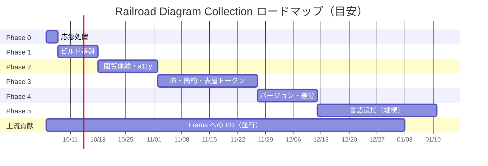
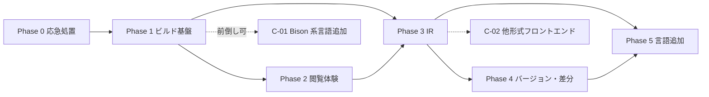

# Railroad Diagram Collection 強化ロードマップ

実装状況（2026-09-30）: v1.0 の Phase 0〜5 の対応と検証方法は [IMPLEMENTATION.md](./IMPLEMENTATION.md) を参照。以下は着手時の調査・計画であり、Lrama の現状は [LRAMA_MASTER.md](./LRAMA_MASTER.md) の再検証結果を優先する。

- 対象リポジトリ: https://github.com/ydah/railroad-diagram-collection （`main` @ `2eb92a9` / 2025-04-12）
- 公開サイト: https://ydah.github.io/railroad-diagram-collection/
- 作成日: 2026-09-30
- 関連文書: [DESIGN.md](./DESIGN.md)（設計書） / [WORK_PROCEDURES.md](./WORK_PROCEDURES.md)（作業手順書）

---

## 1. ビジョン

> **「プログラミング言語の文法を、最も正確に・最も速く・最も読みやすく引ける場所」**

| 柱 | 目指す状態 |
|---|---|
| 正確さ | すべての図に出典（リポジトリ・タグ・コミット）が付き、再現可能なビルドで上流のリリースに数日以内に追従する |
| 読みやすさ | パーサ生成器の生出力ではなく、ループ化・表層トークン表記・相互参照・検索を備えた「人が読むための図」 |
| 広がり | 複数バージョン・差分・多言語・JSON API によって、学習・比較・研究・ツール開発の基盤になる |

---

## 2. 現状分析

### 2.1 リポジトリ構成

| ファイル | サイズ | 内容 |
|---|---:|---|
| `index.html` | 5.9 KB | 手書きのランディングページ |
| `ruby.html` | 576 KB | Ruby の構文図 303 規則 |
| `php.html` | 458 KB | PHP の構文図 186 規則 |
| `perl.html` | 277 KB | Perl の構文図 113 規則 |
| `assets/ogp.png` | 82 KB | OGP 画像（1200×630） |
| `MIT` | 1 KB | MIT ライセンス文 |
| `README.md` | 2.4 KB | 説明 |

- 3 つの言語ページは Lrama の構文図出力（`template/diagram/diagram.html`）をほぼそのまま配置したもの。
- **生成手順・元文法のバージョン・使用した Lrama のバージョンがどこにも記録されていない**ため、再生成も検証もできない。
- コミットは 2 件（2025-04-12）のみで、以後更新されていない。

### 2.2 計測結果（リポジトリを clone して解析）

| 指標 | Ruby | PHP | Perl |
|---|---:|---:|---:|
| 規則（見出し）数 | 303 | 186 | 113 |
| うち中間アクション記号 `$@N` | 39 | 12 | 24 |
| 参照される非終端記号 | 302 | 185 | 112 |
| 終端記号の種類 | 145 | 172 | 129 |
| 図の最大幅 (px) | 1100 | 1784.5 | 1589 |
| 図の最大高さ (px) | 1412 | 2552 | 1592 |
| 幅 1200px 超の図 | 0 | 8 | 1 |
| 未定義参照（リンク切れ） | 0 | 0 | 0 |
| どこからも参照されない規則 | `$accept` のみ | 同左 | 同左 |

- 相互参照の整合性は良好。問題は主に「表示・操作性・再現性・鮮度」にある。
- Ruby ページの `<path>` 要素 9,448 個のうち 4,326 個が長さ 0（`h0.0`）で、削減余地が大きい。
- 幅 375px のモバイル端末（Chromium でエミュレート）で `php.html` を開くと、viewport 指定がないため 980px 幅でレイアウトされ、さらに `svg { width: 100% }` で縮小される。最大幅の図は実効 **約 0.2 倍** になり、文字の高さは画面上 4px 未満になる。

### 2.3 最新リリースから再生成した場合との比較（検証済み）

各言語の最新安定タグの文法を取得し、Lrama 0.8.0 で構文図を再生成して現サイトと比較した（中間アクション記号 `$@N`/`@N` を除いて集計）。

| 言語 | 現サイトの文法 | 再生成に使ったタグ | 規則数 | 終端記号 |
|---|---|---|---|---|
| PHP | 不明（8.5 開発途中と推定） | `php-8.5.0` | 174 → 178（追加 5 / 削除 1） | `T_PIPE` 追加 |
| Ruby | 不明（2025 年 4 月頃の master と推定） | `v4.0.0` | 264 → 265（追加 10 / 削除 9。`asgn_lhs_arg_rhs` → `asgn_arg_rhs` のような改名を含む） | 増減なし |
| Perl | 不明 | `v5.44.0`（前処理が必要、下記） | 89 → 115（追加 31 / 削除 5） | `ATTRLIST`・`PROTOTYPE` 追加 |

検証で分かったこと:

- **Lrama 0.8.0 は Perl 5.44.0 の `perly.y` を読めない。** 規則名とコロンの間にコメントがある書き方（`bare_statement_expression /* … */ : …`）で構文エラーになる。コメントを取り除く前処理を挟めば生成できる（139 規則）。→ L-05
- Ruby の `parse.y` は、Ruby 本体のビルド（`common.mk`）と同じく `tool/id2token.rb` で前処理してから Lrama に渡す必要がある。
- Lrama 0.8.0 の出力でも `stroke: 5`、viewport なし、`'\n'` の二重エスケープは残っている。→ L-01、L-02 は現在も有効
- 中間アクション記号の番号は版ごとにずれ（PHP の `@12` → `@11` など）、`>` のエスケープ表記も Lrama の版で異なる。版間差分には正規化が必須。
- Lrama の `--diagram` 出力には `railroad_diagrams` gem が別途必要（Lrama の依存には含まれない）。

### 2.4 発見したバグ・不具合

重大度: 高 = 利用体験を大きく損なう / 中 = 明確な欠陥 / 低 = 品質上の問題

| ID | 重大度 | 内容 | 根拠・場所 |
|---|---|---|---|
| B-01 | 高 | OGP の `og:url` が空、`og:image` が相対パス（`assets/ogp.png`）。SNS でカード画像が表示されない可能性が高い。`twitter:card`・`meta description`・`canonical` もない | `index.html`（公開サイトでも確認） |
| B-02 | 中 | ライセンスファイル名が `MIT` のため、GitHub の About 欄にライセンスが表示されていない。README は「LICENSE file」と記載 | ルート直下 |
| B-03 | 高 | 言語ページに `<meta name="viewport">`・`<meta charset>`・`lang` 属性がない。モバイルでデスクトップ幅のまま縮小表示される | `ruby.html` 他 |
| B-04 | 高 | `svg { width: 100% }` と固定 `height` 属性の組み合わせにより、幅広の図は画面幅に縮小され文字が読めない（2.2 の計測参照）。上下に不要な余白も出る | Lrama テンプレート由来 |
| B-05 | 低 | ホバー用 CSS の `stroke: 5;` は無効値（意図は `stroke-width`） | Lrama テンプレート由来 |
| B-06 | 中 | 終端記号 `'\n'` が `'\\n'` と二重エスケープで表示される。パラメータ化規則の見出し `option_'\\n'` も同様。Lrama 0.8.0 でも再現 | `ruby.html` |
| B-07 | 中 | 見出しに `id` がなく、規則へのパーマリンクが作れない。非終端記号クリックは `scrollIntoView` のみで URL が変わらず、ブラウザの「戻る」で元の位置に戻れない | 全言語ページ |
| B-08 | 高 | キーボード・タッチで操作できない（`<g>` はフォーカス不可、`mouseenter` 依存）。SVG に代替テキストがない | 全言語ページ |
| B-09 | 中 | 数千要素に個別にイベントリスナーを登録し、ホバーのたびに `querySelectorAll` で全見出し・全ノードを走査している | 全言語ページのスクリプト |
| B-10 | 低 | `<body align="center">`（廃止属性）、`svg.railroad-diagram path` の重複定義、`* { color }` の全称指定 | 全言語ページの CSS |
| B-11 | 中 | 言語ページからトップや他言語へ戻る導線、出典、フッターがない | 全言語ページ |
| B-12 | 低 | トップページの見出し階層が不正（`h2` セクション内のカード見出しも `h2`）。フッターの年が固定 | `index.html` |
| B-13 | 中 | README の構成図が実ファイルと不一致（`assets/`・ライセンスが欠落）。貢献手順の記述が曖昧で、生成手順がない | `README.md` |
| B-14 | 高 | 文法のバージョンが不明で、しかも古い。PHP ページは `T_VOID_CAST` を含むが `T_PIPE`（PHP 8.5 のパイプ演算子 `\|>`）を含まないため、8.5 開発途中のスナップショットと推定される（PHP 8.5.0 は 2025-11-20 リリース済み）。3 言語とも最新リリースと規則が食い違う（2.3 参照） | `php.html` / `ruby.html` / `perl.html` |
| B-15 | 中 | Ruby ページは `parse.y` の文法だが、Ruby 3.4 以降のデフォルトパーサは Prism で、両者の受理範囲に差がある事例も報告されている。その旨の注記がない | `ruby.html` |
| B-16 | 中 | 内部記号がノイズになっている: `$accept`、`$@N`（中身が空の図）、`YYerror`（`error` トークン） | 全言語ページ |
| B-17 | 低 | 箱の幅が「文字数×固定幅」で計算されるため、実際の等幅フォントによっては文字が箱からはみ出す可能性がある | 描画ライブラリの仕様 |

---

## 3. 改善バックログ（全項目）

凡例: 優先度 **P0**=即時 / **P1**=高 / **P2**=中 / **P3**=将来、規模 **S**=半日以内 / **M**=1〜3日 / **L**=1〜2週 / **XL**=2週以上

### 3.1 バグ修正（B）

| ID | 対応方針 | 優先度 | 規模 | Phase |
|---|---|---|---|---|
| B-01 | `og:url`/`og:image` を絶対 URL に、`twitter:card`・`description`・`canonical` を追加 | P0 | S | 0 |
| B-02 | `MIT` → `LICENSE` にリネーム、README のリンク修正 | P0 | S | 0 |
| B-03 | `viewport`・`charset`・`lang` を追加 | P0 | S | 0 |
| B-04 | 図を横スクロール枠に入れて原寸表示（Phase 0 暫定）→ 幅モード・ズーム切替（Phase 2） | P0 | S→M | 0, 2 |
| B-05 | `stroke-width` に修正（上流 Lrama にも報告） | P0 | S | 0 |
| B-06 | エスケープ処理を修正（生成パイプラインで対応、上流にも報告） | P1 | S | 1 |
| B-07 | 規則ごとに安定 ID を付与し、非終端記号クリックを履歴に積む（Phase 0）→ 実リンク化（Phase 2） | P0 | S | 0, 2 |
| B-08 | SVG 内 `<a href>` 化、フォーカス表示、テキスト代替（BNF） | P0 | M | 2, 3 |
| B-09 | イベント委譲＋事前計算した索引で書き直し | P1 | S | 2 |
| B-10 | CSS の整理（テンプレート化で解消） | P2 | S | 0, 1 |
| B-11 | 共通ヘッダー・フッター・出典パネル | P0 | S | 0, 1 |
| B-12 | 見出し階層修正、年の自動化 | P1 | S | 0 |
| B-13 | README 全面更新 | P0 | S | 0 |
| B-14 | 最新安定版から再生成し、出典（タグ・コミット）を明記 | P0 | M | 1 |
| B-15 | 「パーサ文法であり言語仕様そのものではない」「Ruby は parse.y 基準」の注記 | P1 | S | 1 |
| B-16 | 内部規則の表示切替（Phase 2）→ 図からも除去（Phase 3 の簡約） | P1 | S | 2, 3 |
| B-17 | フォントスタックを明示し、`textLength` で箱に収める（Phase 3 の独自レンダラ） | P3 | M | 3 |

### 3.2 基盤・運用（O）

| ID | 内容 | 優先度 | 規模 | Phase |
|---|---|---|---|---|
| O-01 | **再現可能ビルド**: `grammars/manifest.yml` で取得元・タグ・コミットを固定し、`rdc build` で全ページを生成 | P0 | L | 1 |
| O-02 | GitHub Actions による Pages デプロイ（生成物を `main` に直接置かない） | P0 | M | 1 |
| O-03 | CI 品質ゲート: HTML 検証・リンク切れ・axe・Lighthouse・ビジュアル回帰・E2E | P1 | M | 2 |
| O-04 | 上流監視ボット: 週次で新タグを検出 → 再生成 → 差分要約付き PR を自動作成 | P1 | M | 4 |
| O-05 | リポジトリ衛生: `LICENSE`、`CONTRIBUTING.md`、Issue/PR テンプレート、`CHANGELOG.md`、`.editorconfig` | P0 | S | 0 |
| O-06 | 旧 URL 互換: `/ruby.html` 等から新 URL へのリダイレクト | P1 | S | 1 |
| O-07 | SEO: `sitemap.xml`、`robots.txt`、`canonical`、構造化データ | P2 | S | 5 |
| O-08 | 404 ページ | P3 | S | 6 |
| O-09 | 各文法ソースのライセンス確認と帰属表示 | P0 | S | 0, 1 |

### 3.3 閲覧体験・UI（U）

| ID | 内容 | 優先度 | 規模 | Phase |
|---|---|---|---|---|
| U-01 | 規則目次サイドバー＋インクリメンタル絞り込み | P0 | M | 2 |
| U-02 | 規則パーマリンク（`#r-<slug>`）とリンクコピー | P0 | S | 0, 1 |
| U-03 | 非終端記号を SVG の `<a href>` にする（ネイティブ遷移・戻る・新規タブ・キーボード対応・JS 不要） | P0 | M | 2 |
| U-04 | レスポンシブ表示: 原寸＋横スクロール／幅に合わせる／ズームの切替 | P0 | M | 2 |
| U-05 | ダークモード（OS 追従＋手動トグル） | P1 | S | 2 |
| U-06 | 被参照一覧（Used by）・参照一覧 | P1 | S | 2 |
| U-07 | 非終端記号のホバー／フォーカスで参照先の図をポップアップ表示 | P2 | M | 3 |
| U-08 | 開始記号からの到達パス（パンくず: `program › top_stmts › … › stmt`） | P2 | S | 2 |
| U-09 | 内部規則（`$accept`、`$@N`）の表示切替。パラメータ化規則のインスタンスにはバッジ | P1 | S | 2 |
| U-10 | キーボードショートカット（`/` 検索、`j`/`k` 前後の規則、`?` ヘルプ） | P2 | S | 2 |
| U-11 | 図ごとのツールバー（リンクコピー・SVG/PNG 保存・BNF 表示・全画面） | P2 | M | 3 |
| U-12 | 共通グローバルヘッダー（言語・バージョン切替、検索、テーマ） | P0 | S | 1 |
| U-13 | 印刷用 CSS | P3 | S | 6 |
| U-14 | UI の多言語化（日本語／英語） | P3 | M | 5 |
| U-15 | トップページ刷新: 言語カードに規則数・バージョン・更新日を自動表示、横断検索、図の読み方の凡例 | P1 | M | 2 |

### 3.4 文法データの高度化（G）

| ID | 内容 | 優先度 | 規模 | Phase |
|---|---|---|---|---|
| G-01 | **中間表現（IR, JSON）** の導入: 規則・選択肢・終端記号・出典を構造化 | P1 | L | 3 |
| G-02 | トークンの表層表記: `keyword_class` → `class`、`T_ABSTRACT` → `abstract`（`%token` の文字列別名＋手動上書き YAML） | P1 | M | 3 |
| G-03 | **図の簡約**: 左再帰→ループ、ε→省略可能、パラメータ化規則のインライン展開、中間アクション除去、共通接頭辞のくくり出し（「原文どおり」表示への切替付き） | P1 | XL | 3 |
| G-04 | BNF テキスト表示（コピー可能。アクセシビリティ上のテキスト代替も兼ねる） | P1 | M | 3 |
| G-05 | 終端記号索引: キーワード・演算子がどの規則で使われるか | P1 | S | 3 |
| G-06 | 最短導出例の自動生成（各規則から導出できる最短の終端記号列） | P2 | M | 5 |
| G-07 | 文法メトリクス: 規則数、選択肢数、再帰の有無、被参照数ランキング | P3 | S | 6 |
| G-08 | 静的 JSON API（`/api/v1/...`） | P2 | S | 3 |
| G-09 | 規則のカテゴリ分類（文・式・パターン・リテラル…）を言語別メタデータで付与 | P2 | M | 5 |
| G-10 | キュレーションしたコード例＋ CI で実処理系による構文チェック | P2 | L | 5 |

### 3.5 バージョン・差分（V）

| ID | 内容 | 優先度 | 規模 | Phase |
|---|---|---|---|---|
| V-01 | 言語ごとに複数バージョンを保持し、バージョン切替 UI を提供（アンカー維持） | P1 | L | 4 |
| V-02 | **バージョン間差分ページ**: 規則の追加／削除／変更、選択肢単位の差分ハイライト、終端記号の追加／削除 | P1 | L | 4 |
| V-03 | 言語別の文法変更履歴（Changelog）を自動生成 | P2 | M | 4 |
| V-04 | 規則・選択肢に「このバージョンで追加」バッジ | P2 | S | 4 |

### 3.6 コンテンツ拡充（C）

| ID | 内容 | 優先度 | 規模 | Phase |
|---|---|---|---|---|
| C-01 | Lrama で扱える Bison/Yacc 文法の追加。候補: PostgreSQL（`gram.y`）、Bash（`parse.y`）、gawk（`awkgram.y`）、jq（`parser.y`）、mruby（`parse.y`）など。**Lrama 互換性とライセンスは個別に要検証** | P1 | M/言語 | 5 |
| C-02 | 他形式フロントエンド: ANTLR4（`.g4`、grammars-v4 の Python/Java/Go/Kotlin 等）、W3C 形式 EBNF（仕様書記載の文法）、PEG（CPython の `Grammar/python.gram`） | P2 | XL | 5 |
| C-03 | 言語横断比較ビュー（if・関数定義・クラス定義などを並べて比較） | P3 | L | 6 |
| C-04 | README の Future Plans（Python/JavaScript/Go）は Yacc 系文法ではないため C-02 が前提であることを明記 | P1 | S | 0 |

### 3.7 上流（Lrama）への貢献（L）

このサイトの不具合の多くは Lrama のテンプレートに由来する。上流で直せば Ruby 本体の `tool/lrama` を使う parse.y 開発者にも恩恵がある。

| ID | 内容 | 優先度 | 規模 | Phase |
|---|---|---|---|---|
| L-01 | テンプレートの `stroke: 5` 修正、`viewport`/`charset`/`lang` 追加、`svg { width: 100% }` の見直し | P1 | S | 0〜 |
| L-02 | 終端記号の二重エスケープ修正 | P1 | S | 1〜 |
| L-03 | 見出しへの `id` 付与、非終端記号の `<a href>` 化、キーボード対応、長さ 0 のパスの省略 | P2 | M | 2〜 |
| L-04 | 文法の JSON ダンプ出力（本プロジェクトの IR 生成を安定させる） | P2 | M | 3〜 |
| L-05 | 規則名とコロンの間のコメント（`lhs /* … */ : …`）を受け付けるようにする（Perl 5.44.0 の `perly.y` で発生。Bison は受理する） | P1 | S | 1〜 |

### 3.8 研究・実験（R）

| ID | 内容 | 優先度 | 規模 |
|---|---|---|---|
| R-01 | Playground: 入力したコードの解析で使われた規則を図上でハイライト（wasm 版処理系、または Lrama 生成パーサのトレース） | P3 | XL |
| R-02 | 規則依存グラフの全体マップ可視化 | P3 | L |
| R-03 | 規則単位の OGP 画像自動生成 | P3 | M |
| R-04 | 埋め込みウィジェット（ブログ等に図を埋め込む URL/iframe） | P3 | M |
| R-05 | PWA／オフライン対応 | P3 | M |
| R-06 | 差分での規則名変更（rename）の推定 | P3 | M |

---

## 4. フェーズ計画

| Phase | 名称 | 期間目安 | 主な対象 | 完了時の状態 |
|---|---|---|---|---|
| 0 | 応急処置 | 〜3 日 | B-01〜05, B-07(暫定), B-10〜13, U-02(暫定), O-05, O-09, C-04, L-01 起票 | 既存 3 ページがモバイルで読め、規則へリンクでき、OGP とライセンスが正しく機能する |
| 1 | 再現可能なビルド基盤 | 1〜2 週 | O-01, O-02, O-06, B-06, B-14, B-15, U-02, U-12, L-05 起票 | `rdc build` 一発で全ページが最新安定版から生成され、Actions でデプロイされる |
| 2 | 閲覧体験・アクセシビリティ | 2〜3 週 | U-01, U-03〜06, U-08〜10, U-15, B-08, B-09, B-16(表示切替), O-03 | 目次・リンク・ダークモード・キーボード操作が揃い、CI の品質ゲートが稼働 |
| 3 | 文法データ高度化 | 3〜5 週 | G-01〜05, G-08, U-07, U-11, B-16(除去), B-17, L-02〜04 | IR ベースの独自描画、表層トークン表記、簡約図、BNF、JSON API |
| 4 | バージョンと差分 | 2〜3 週 | V-01〜04, O-04 | 複数バージョンと差分ページ、上流更新の自動 PR |
| 5 | コンテンツ拡充 | 継続 | C-01, C-02, G-06, G-09, G-10, U-14, O-07 | 収録言語の拡大（非 Yacc 系を含む） |
| 6 | 発展・実験 | 随時 | R-*, C-03, G-07, U-13, O-08 | — |

### 4.1 依存関係

- Phase 2 は Phase 1 の生成パイプライン（Lrama HTML 後処理方式）の上に構築する。Phase 3 で IR 方式に置き換えても UI（テンプレート・JS・CSS）と規則 ID はそのまま使える設計にする。
- V-02（差分）は IR の正規化に依存するため、必ず Phase 3 の後に行う。
- C-01（Bison 系言語の追加）は Phase 1 完了後なら前倒しできる。

---

## 5. マイルストーンと完了条件

| マイルストーン | 対応 Phase | 完了条件 |
|---|---|---|
| v0.1 | 0 | B-01〜05・B-10〜13 が解消。幅 375px で最大幅の図が原寸で横スクロール表示され、ページ全体は横スクロールしない。GitHub の About 欄に MIT ライセンスが表示される |
| v0.2 | 1 | 3 言語が最新安定版で再生成され、各ページに出典（repo/tag/commit、Lrama バージョン）が表示される。`main` への push で自動デプロイ |
| v0.3 | 2 | axe 違反 0、キーボードのみで全規則を辿れる。Lighthouse（モバイル）Accessibility 100 |
| v0.5 | 3 | IR から全ページを描画。簡約図と原文どおりの切替、表層トークン表記、BNF 表示、JSON API |
| v0.7 | 4 | 各言語 2 バージョン以上と差分ページ。上流の新リリースから 7 日以内に PR が自動作成される |
| v1.0 | 5 | 収録 8 言語以上（うち非 Yacc 系 2 以上）。ドキュメント・貢献ガイドが整備済み |

---

## 6. KPI

| 指標 | 目標 |
|---|---|
| Lighthouse（モバイル、最大ページ） | Performance ≥ 90 / Accessibility 100 / Best Practices 100 / SEO 100 |
| axe-core 違反 | 0 |
| 追加 JS 転送量 | ≤ 30 KB（gzip）、外部オリジンへのリクエスト 0 |
| 上流リリース → サイト反映 | ≤ 7 日 |
| 出典表示率 | 全ページ 100% |
| 収録言語数 | v1.0 で 8 以上 |
| 簡約の正しさ | 等価性テストの全件合格（簡約前後で導出できる記号列が一致） |

---

## 7. リスクと対策

| リスク | 影響 | 対策 |
|---|---|---|
| 追加したい文法が Lrama で読めない | 言語追加が止まる | GNU Bison の `.output` レポートを読むフロントエンドを用意。前処理が必要なら manifest に手順を記述 |
| 文法ソースのライセンス | 公開できない可能性 | 収録前にライセンスを確認し、出典と帰属を表示。疑義があれば収録を見送る |
| Lrama 内部 API の変更 | IR 生成が壊れる | Lrama のバージョンを固定。上流に JSON ダンプ機能を提案（L-04） |
| 簡約アルゴリズムの誤り | 誤った文法を表示してしまう | 等価性テストを必須化。原文どおりの図をいつでも表示できるようにする |
| パーサ文法と実際の言語の乖離（字句解析器の状態・意味検査） | 利用者の誤解 | 各ページに「パーサ文法であり言語仕様そのものではない」旨を明記 |
| 多バージョン化による成果物の肥大 | ビルド時間・転送量の増加 | コミットするのは IR のみ、HTML は CI で生成。`content-visibility` で描画コストを抑える |
| メンテナの負荷 | 更新が止まる | 上流監視ボット、言語追加チェックリスト、PR テンプレートで属人性を下げる |

---

## 付録 A. ID 一覧

| 系列 | 範囲 | 内容 |
|---|---|---|
| B | B-01〜B-17 | バグ修正 |
| O | O-01〜O-09 | 基盤・運用 |
| U | U-01〜U-15 | 閲覧体験・UI |
| G | G-01〜G-10 | 文法データ |
| V | V-01〜V-04 | バージョン・差分 |
| C | C-01〜C-04 | コンテンツ |
| L | L-01〜L-05 | 上流貢献 |
| R | R-01〜R-06 | 研究・実験 |

各 ID は GitHub Issue 1 件に対応させる（起票手順は WORK_PROCEDURES.md の 0.4 節）。
